# T-shirt Designer

A simple not-entirely-functional t-shirt designer webapp made for the course Browser Technologies at the University of Applied Sciences Amsterdam. The main purpose of this webapp is to demonstrate the use of progressive enhancement. To create something can can remain mostly functional when it's only html, html/css and so on.

<br>

<div style="display: flex;">
  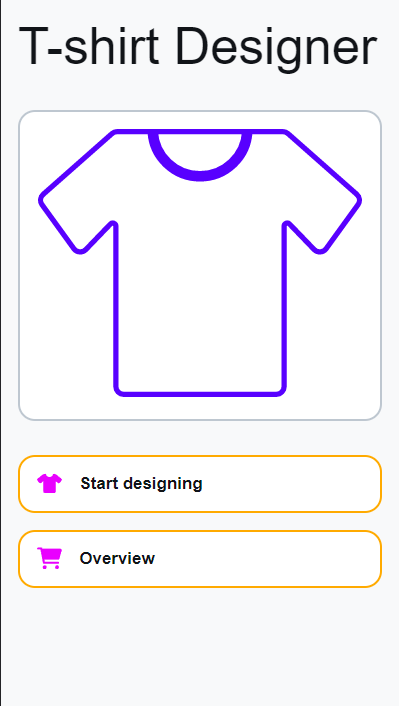
  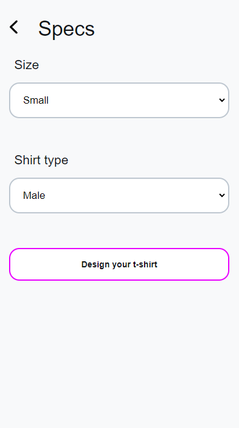
  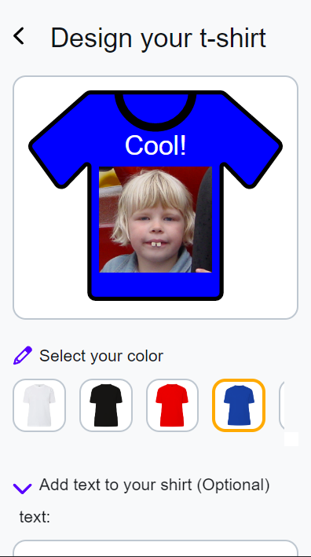
  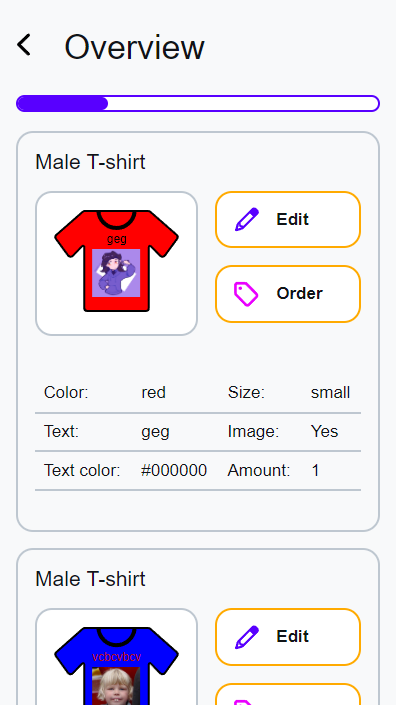
  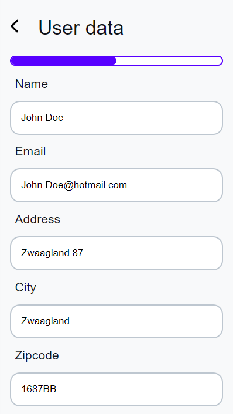
  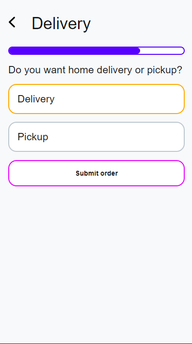
  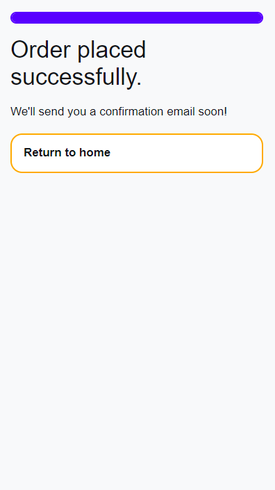
</div>

## Live demo

You can find a live demo of this webapp [here](https://sasjakoning.github.io/t-shirt-designer/).

## Installation

This webapp is made using pure vanilla html/css and Javascript. To run it, you can simply open the index.html file in your browser.

<br>
<hr>
<br>

## Table of Contents

- [T-shirt Designer](#t-shirt-designer)
  - [Live demo](#live-demo)
  - [Installation](#installation)
  - [Table of Contents](#table-of-contents)
  - [Process](#process)
    - [User Story](#user-story)
    - [Requirements](#requirements)
    - [Core functionality](#core-functionality)
    - [Flowchart](#flowchart)
    - [Testing](#testing)
    - [Feature detections](#feature-detections)
    - [Server-side](#server-side)
    - [No CSS](#no-css)
    - [Feedback session 1](#feedback-session-1)
    - [Feedback session 2](#feedback-session-2)
  - [Sources](#sources)

<br>

<!-- TOC --><a name="process"></a>
## Process

Below you will find my process of creating this webapp. I will explain the choices I made and why I made them. I'll also include feedback sessions and the changes I made based on the feedback. I will be doing these on a weekly basis.

<br>

In the first week of this project I received the briefing. The goal of this project is to create a demo based on a chosen user story. I have to make sure the demo is usable (for atleast it's core functionality) by all users, on all browsers and in all contexts.

The demo should be build in three layers following the principles of progressive enhancement.

During this project it's not allowed to use polyfills and NPM packages. It is allowed to use server side rendering but not required.

<br>

<!-- TOC --><a name="user-story"></a>
### User Story

The user story I chose is the following:

> As a user I want to be able to design, save and order a nerdy t-shirt (with text and images). I also want to be able to continue where I left off when I come back to the site.

<br>

<!-- TOC --><a name="requirements"></a>
### Requirements

The requirements for this project are the following:

- User info (Name, phone number or email)
- Color of the t-shirt
- Text on the t-shirt
- Size of the t-shirt
- Male/female t-shirt
- Image on the t-shirt (or behind the shirt to compare)
- Continue where you left off, review t-shirt design.
- Validation, everything needs to be filled in, show clear error messages.
- User should be able to create multiple designs and review them. There should be an overview page.
- There should be an order page where the user can order the t-shirt.

Because the project will be a demo, Actually ordering the shirt doesn't have to be entirely functional.

<br>

<!-- TOC --><a name="core-functionality"></a>
### Core functionality

The core functionality of this project is the ability to design a t-shirt. This means the user should be able to choose a color, add text, add an image and choose a size. The user should also be able to order the design.

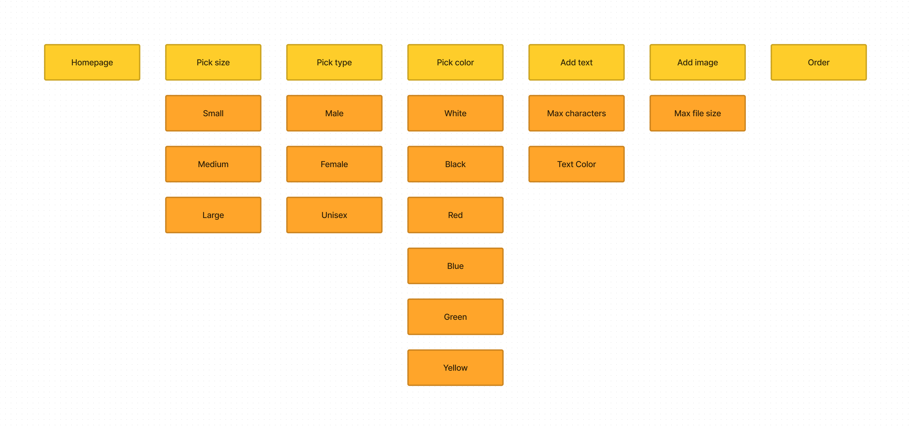

<br>

<!-- TOC --><a name="flowchart"></a>
### Flowchart

To get a better understanding of the flow of the webapp I made a flowchart. This flowchart shows the different steps the user will take to create a t-shirt design.


<br>

### Testing

To test the core functionality of this webapp I used the following browsers:

- Chrome
- Firefox
- Safari (For IOS)
- UC Browser (For android)

Generally the webapp works on all browsers, with some minor styling issues in Safari and UC Browser. UC and Safari didn't respond to list-style none on the `<summary>` element which caused the arrow to be displayed. I fixed this by adding a bit of webkit code: 

```css
  /* hide default details arrow */
  details > summary::-webkit-details-marker {
    display: none;
  } 
```

There also seemed to be an issue when it came to styling the `<progress>` element. This turned out to be a simple fix using `-webkit-appearance: none;`.

<br>

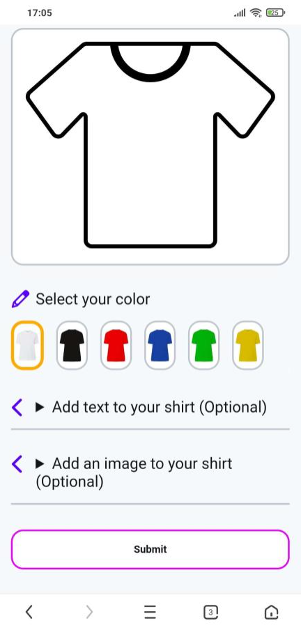
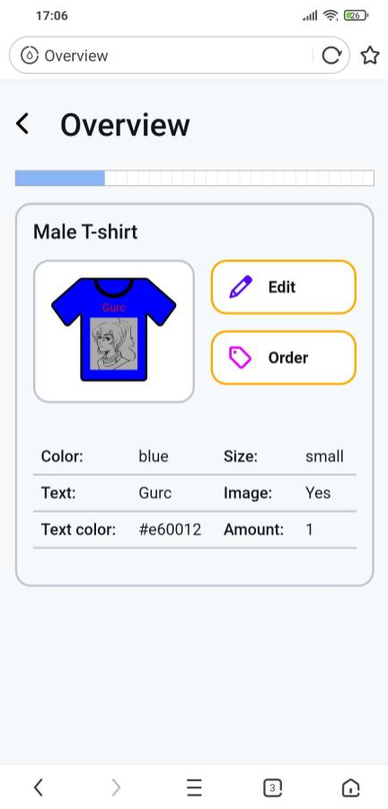

<br>

The UC browser also doesn't support the `:has()` selector yet. This caused the t-shirt preview image not not change color when the user selects one using the radio buttons. I attempted to fix this by using Javascript to check if the browser supports `:has()` and if not by using the following code:

```javascript
  // check if browser supports :has()
  if (CSS.supports(':has(*)')) {
    // Do something
  } 
```
However, this doesn't seem to work like it should have because it also thinks browsers like Chrome don't support `:has()`. I decided to leave this as is for now since it doesn't affect the core functionality of the webapp.

<br>

When it comes to Safari, there were a few things that seemed to have different (default) styling compared to other browsers. The `<select>` element seemed to ignore it's given padding and instead stuck to it's default. There is also a color type `<input>` which turned into a strange stretched circle, where other browsers would turn it into a rectangle. I fixed this by adding the following code:

```css
input[type="color"] {
	appearance: none;
	-webkit-appearance: none;
	width: 100%;
	height: 2rem;
	border: none;
	border-radius: 1rem;
	margin-bottom: 1rem;
	font-size: 1rem;
	position: relative;
}
```

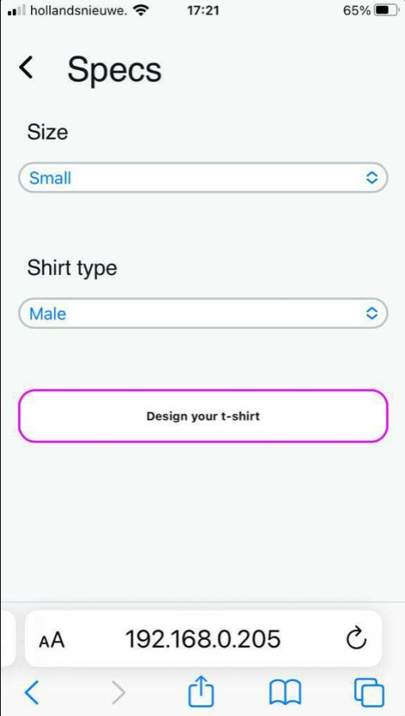
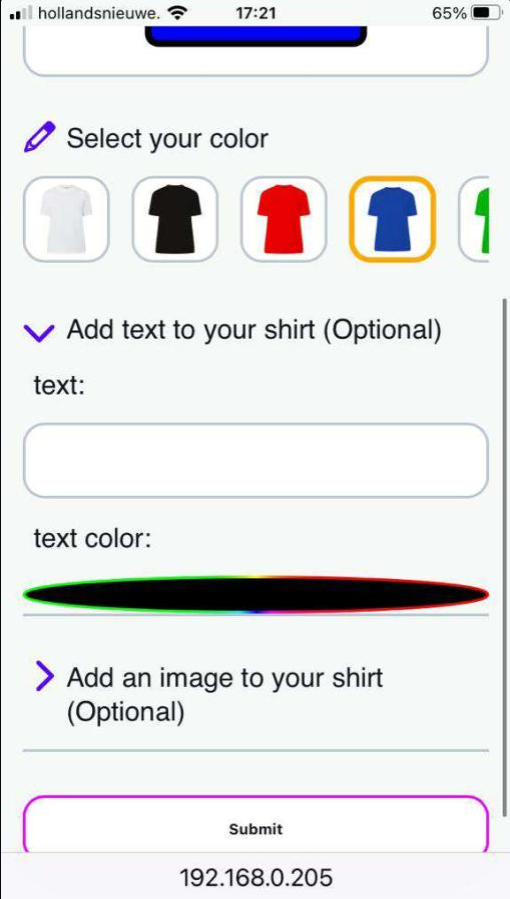

<br>

### Feature detections

During this project I didnt have to make much use of feature detection. While working on this project I already coded with older browsers in mind which meant I started using alternatives for certain things. For example, I used margins for elements where I would usually use Flex gap. I also didn't come across many features that I wanted to use that weren't widely supported already. The only issue I ran into was the `:has()` selector which I mentioned earlier.

<br>

### Server-side

because this project is a demo, I decided to not use server-side rendering. This means that there are a few instances where the app wont function correctly, where there would be server-side logic going on. For example, the user should be able to save their design and continue where they left off. This is not possible in this demo because there is no server-side logic to save the design. 

<br>

Because I still wanted to give the illusion of saving designs and file uploads, I decided to use local storage to save the designs. This means that the user can save their design and continue where they left off, but only on the same device. This is because local storage is only available on the device it was saved on.

<br>

The user also wont be able to actually order anything using this app.

<br>

### No CSS

When the user disables CSS, the app will still function correctly. The user will still be able to design a t-shirt and order it. 

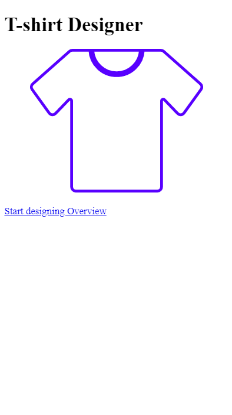
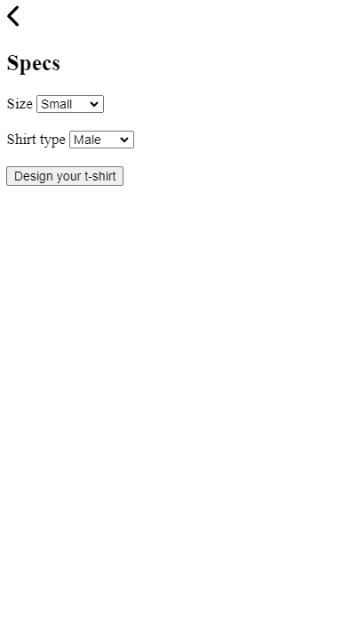
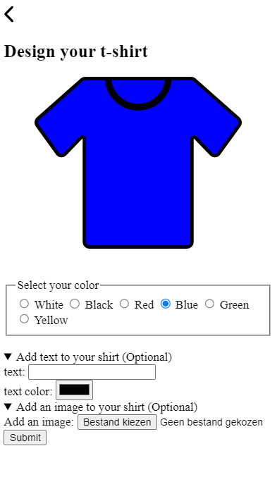
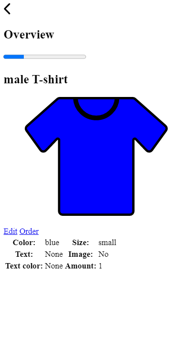

<br>


### Feedback session 1

The first feedback session of this project was held friday 24/03/2023. During this session I showed my progress so far with the flowchart and base html. I was told I was well on my way and that I should continue working the way I am now.
 
<br>

### Feedback session 2

The second (and last) feedback session was held friday 31/03/2023. I showed my progress so far and got some feedback on the layout of my app, which could use some improvements and edits for the desktop version, and got tips to improve functionality when there was no CSS or Javascript available.
 
<br>

## Sources

- [Progressive Enhancement](https://developer.mozilla.org/en-US/docs/Glossary/Progressive_Enhancement)
- [Course Github](https://github.com/cmda-minor-web/browser-technologies-2223)
- [HTML elements default styling](https://sans.style/)
- [List of HTML elements](https://developer.mozilla.org/en-US/docs/Web/HTML/Reference)
